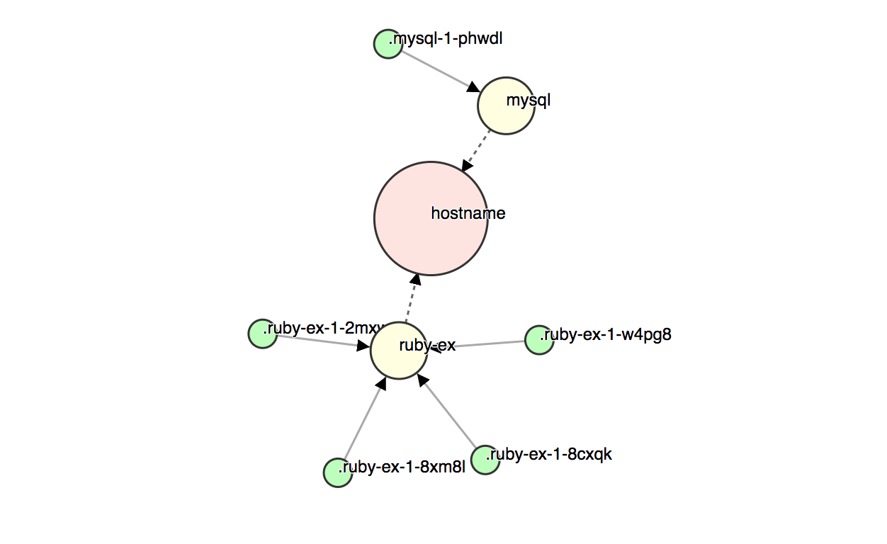

# OCP Vizz (ocpvizz)

This is a very simple project + service + pod visualizer for OpenShift Container Platform 3.7 or later.

It's derived from [dvizz](https://github.com/eriklupander/dvizz), but has switched out the Docker stuff in the backend in favor of the OpenShift REST API.

### Legend
- Red circle: Your project.
- Yellow circle: A service
- Green circle: A pod

Stuff like multiple projects, pods without services, containers per pod and all that fancy stuff is on the TODO-list.

### Running
Run from the command line. First, you need to know the following:

* URL / IP + port of your OpenShift cluster.
* Name of your "project"
* An AUTH token.

The first two are hard-coded right know so change them in main.go.

The AUTH token needs to be set as an env var, e.g:

    $ export OCP_AUTH_TOKEN=the-token-goes-here
    
To get hold of an auth token, you could perhaps use "oc" if you're logged in to your cluster from the command-line:

    $ oc whoami -t
    
Of course, the hard-coded stuff is just temporary...
